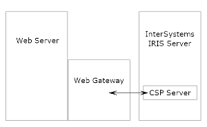

本文介绍InterSystems Web Gateway的安装和配置。

在2018以前的ISC产品中， InterSystems Web Gateway被称为CSP Gateway。， CSP是Cache'的页面技术。InterSystems的产品页面，Web服务等大多是CSP写成的。IRIS发布后CSP Gateway改名成Web Gateway, 但内部的配置文件，说明等等还到处可见CSP Gateway的叫法。在本文里不同的地方有这两个说法别奇怪，他们是一个东西。
IRIS通过它和外部Web服务器连接。 本文的内容适用任何ISC产品的部署，包括页面的选项Cache'. IRIS，HealthConnect, Ensemble等等。它的作用和表现是一样的。 无论您使用的是Cache',IRIS , HealthConnect还是HealthShare, 只有在生产环境中使用HTTP请求，基本上都需要使用Web Gateway。

如果需要更详细的内容，请参考在线文档：[InterSystems Web Gateway](https://docs.intersystems.com/healthconnectlatest/csp/docbook/DocBook.UI.Page.cls?KEY=PAGE_web_gateway)

## 什么是Web Gateway

CSP是Cache' Server Page的缩写，如同JSP(Java Server Page)是Java的前端技术， CSP是InterSystems的前端技术。要在IRIS或者HealthConnect上提供一个HTTP服务，唯一安全可靠的技术是CSP. 创建HTTP,REST服务直接创建CSP页面， 创建SOAP服务使用%SOAP.WebService或者EnsLib.SOAP.Service, 它们都是%CSP.Page的子类，因此在IRIS的在线文档中有CSP Server的称法，指的就是IRIS中负责CSP处理的那部分功能。 

CSP Server并不监听TCP端口得到HTTP消息，它只能通过CSP Gateway从Web服务器接收请求。用户的请求要先发给IIS/Apach/Nginx等Web服务器，转发给IRIS, 而Web Gateway就是Web服务器发请求给IRIS所使用的网关。

或者说， 它是InterSystems提供的给第三方Web服务器的一个组件，或者称为模块。在Windows系统中是若干DLL库文件，在LINUX环境是SO动态链接库。安装CSP Gateway就是诸如”CSPa24.so"等文件拷贝到Web服务器的目录，将这些模块配置到Web服务器，并将以.csp,.cls,.zen结尾的HTTP请求发送给IRIS。如果Web服务器和IRIS独立安装在不同的硬件服务器上(更安全的方式)，发送的是TCP消息，到IRIS的superserver端口，默认是51773(Cache'是1972）。

CSP Gateway支持3种Web服务器：IIS, Apache Web Server, Nginx。 后面的链接提供了完整的在各种操作系统中ISC产品支持的Web Server的版本: [IRIS支持的第三方Web Server列表](https://docs.intersystems.com/healthconnectlatest/csp/docbook/platforms/ISP_technologies.html#ISP_webservers)

听上去是不是挺简单？那用户还有什么可糊涂的？

## Private Web Server(PWS)带来的混乱

混乱来自IRIS的安装过程会安装一个私有的Apache Web服务器，被称作PWS。它的作用有两个：支持访问维护页面;给一个测试环境提供测试Web服务的能力。在线文档是这么描述PWS的：
    >> The PWS is not supported for any other purpose.
    For deployments of http-based applications, including REST, CSP, Zen, and SOAP over http or https, you should not use the private web server for any application other than the Management Portal; instead, you must install and deploy one of the supported web servers. For information, see the section “Supported Web Servers” in the online InterSystems Supported Platforms document for this release.(**如果要部署http应用， 包括在http或者https上层的REST, CSP, Zen, SOAP，你绝不能让除Management Portal以外的任何应用使用PWS. 你必须安装一个IRIS兼容的Web服务器。了解这部分内容， 请查看InterSystems在线文档的"Supported Web Servers"部分**)

然后很多用户没有意识到这个提醒。当安装IRIS时被问到”你想要安装CSP网关并未CSP网关配置外部Web服务器(IIS和Apache)吗？"时，他们选择了“不要安装CSP网关"，然后浏览器接入维护界面，开发了若干Web服务，一直没有意识使用PWS访问IRIS上的Web服务在生产环境是不可接受的。PWS是一个非常轻量级的Apache Web服务器。它的程序包在IRIS安装目录下的httpd子目录里。IRIS启动后， 它开始工作，监听IRIS上配置的Web端口，默认是57772,或者52773.它的工作机制决定了它无法承受大的负载，因此不能用于生产环境的http应用。

它和CSP/IRIS Server的连接用的是与上面讲的CSP Gateway完全相同的方式，也就是说，这里有一个PWS专用的Gateway, 我们可以称它为Private CSP Gateway。为了写的更清楚，总结了下面几点：

***CSP Gateway***
- 安装IRIS实例时用户可以选择是否安装CSP Gateway. 如果这时没选择安装，后面可以用单独的安装包安装。
- 安装的程序可以放在任何位置。比如在Linux默认放在"/opt/webgateway"目录，配置文件在Web Gateway的配置文件目录。
- 访问CSP Gateway的管理页面是 http://WebServer:80/csp/bin/Systems/Module.cxw 。 （这里的WebServer是Web服务器的地址，➕它的端口是默认的80)

***PWS***
- 安装时自动安装
- 程序和配置都在IRIS的安装目录，比如"C:/InterSystems/HealthConnect/CSP/bin/"
- 访问管理页面的地址是 http://IRIS:57772/csp/bin/Systems/Module.cxw，这里的IRIS是IRIS服务器的地址，如果是本机登录，也就是localhost. 

注意一点：从PWS访问IRIS管理页面， 比如 http://localhost/csp/sys/UtilHome.csp, 选择其中的 “系统管理 > 配置 > Web网关管理"进入的是PWS的配置。如果是从 http://WebServer/csp/sys/UtilHome.csp进入的IRIS管理页面， 那么同样的操作进入的是CSP Gateway的管理页面。 这很容易从页面显示的Web Server的类型和版本发现区别。 

    （image）

好了， 让我们开始安装配置CSP Gateway吧。

# 安装CSP Gateway步骤

    ### 在Apache Web Server上安装
    ### 在IIS上安装
    ### 在Nginx上安装
    ### 配置(Web服务器+CSP Gateway)到IRIS的连接

# 其他关于部署CSP Gateway的疑问

## 一个Web服务器可以连接多个CSP Gateway吗？
如果你真正理解了CSP Gateway, 你就明白它是Web服务器工作的一部分，比如在IIS里面它就是配置的一个虚拟路径。技术上你可以多配一个，但完全没有必要。 如果要把HTTP从一个Web服务器发到多个IRIS, 可以在一个Web Gateway里配置多个"Server Access"连接。

## 一个CSP Gateway是怎么连接多个IRIS Server的？

CSP Gateway可以配置多个"Server Access”， 问题是怎么区分路径到那里。。。

### Web Server要和IRIS部署在一台服务器吗？ 

生产环境中， 一个HTTP请求应该被发送给第三方的Web Server, 然后转发给Web Gateway, 然后由Web Gateway通过TCP发送给Caché /IRIS的superserver端口(默认是1972和52772)。

（image2)

所以， Web Gateway通常安装在第三方Web Server的同一台服务器: 如果Web Server和Caché/IRIS分别装在两台服务器， Caché/IRIS安装时选择“不要安装CSP网关”，在Web Server的服务器上安装单独的Web Gateway软件包，测试和Caché/IRIS的连接。 如果是Web Server和Caché/IRIS装在同一台服务器， 那么应该先安装Web Server, 然后使用Caché/IRIS安装包安装Caché, 选择 “安装CSP网关”， 这样CSP网关会被安装在Web Server的目录下， 相关的模块和Web Server配置也会自动完成。 如果顺序反过来， 那么需要手工配置Web Server， 增加的不必要的复杂步骤。 

### 安装外部Web Server能使用私有Web Gateway吗？
对Web服务器有了解的用户更会有这样的疑问。既然Web Gateway只是给Web Gateway工作的程序组件，那么是否从外部服务器就可以直接使用私有的Web Gateway了，何必再多安装一个。 是的，技术上这样是可行的。前提是，1. 外部Web服务器和IRIS在一台硬件服务器上。2. 客户要对外部服务器的配置非常熟悉，可以手工配置外部Web服务器对私有Web Gateway的访问， 包括路径或者虚假路径，文件夹的访问权限，用户或者用户组的权限等等。总的说， 这样既麻烦，又不便于后期的管理，因此我推荐还是重新装一个Web Gateway。只是要分清它和私有的连接PWS的Web Gateway的区别，而永远不要让他们混在一起。