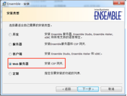

IIS在Windows Server里是默认安装，在Windows7和Windows10里面需要用户到"控制面板>程序"里面找到"Turn Windows features on or off"的设置来启动。 本文假设IIS已经在用户的服务器上启动，并且正常工作。

通常情况下，当IRIS安装在Windows系统时，用户会在同一台机器上使用IIS，很少有单独安装一台IIS服务器给远程IRIS提供Web服务器的，当然这样也绝无问题。

有两个软件包可以安装CSP Gateway。一个是IRIS的安装包。在IRIS的安装过程中， 如果有IIS正在工作， 那么安装程序会自动的安装CSP Gateway。 2018年以前的Ensemble或者Cache'的版本的安装过程中会跳出一个询问框，让用户选择是否"安装CSP网关。。。”。而后来的版本大多不做询问而自动为用户做了选择。 如果需要强制安装或者不安装CSP Gateway，那么需要在安装中选"Customer Component"设置。

另一个软件包是单独的CSP Gateway安装包， 可以在InterSystems的WRC或者工程师处得到。这是一个只有10多兆的很小的安装包，它只安装CSP Gateway, 并不安装IRIS实例，适合在单独的IIS硬件服务器上安装CSP Gateway; 或者， 当一个服务器上已有了IRIS, 但后来想添加IIS服务和CSP Gateway。  

CSP Gateway的安装会在IIS的工作目录“C:\Inetpub"下添加子目录CSPGateway，或者WebGateway, 然后在IIS的default Website上添加CSP Gateway的配置。整个配置相当简单。下面的步骤是在Windows10上单独安装Web Gateway安装包2020.1连接同一台服务器上的IRIS的的过程。

其中后面配置CSP Gateway访问IRIS应用的部分可以参考Apache上配置CSP Gateway的文档。 

## CSP Gateway安装

1. 使用浏览器访问 http://localhost, 显示IIS的欢迎主页, 确认IIS已工作。
2. 打开WebGateway-20201.1.xxxx-win_x64应用程序开始安装。安装时会提示用户输入连接的IRIS Server的IP地址和端口。默认的Application Name用CSP,IP地址端口使用localhost, 51773。安装过程会重启IIS服务，安装结束后用户不用手工重启。 

   

   

3. 安装后的检查IIS
  - 检查Web Gateway安装后的文件。 确认在IIS的安装目录(默认为C:\inetput)下安装了CSPGateway子目录， 其中包含若干dll文件。它们是IIS中用到的CSP Gateway的模块，在不同的CSP Gateway版本中这些Dll文件的数量和名字稍有不同。
  - 创建了c:/intersystems/WebGateway的文件夹，早些的版本中并不创建这个目录。
  - 打开IIS配置界面， 确认在Default Site下安装了CSP application. 
    在某些版本的Web Gateway安装后， /csp被安装为Virtual Directory, 关于IIS中application和virtual diectory的区别请自行查询， 无论安装成那种类型， 对csp的使用和配置没有区别。使用HealthConnect 2018以前版本的安装包安装的CSP Gateway生成CSP和ensemble两个Application。

    
  
4. 查看CSP Gateway登录页面。

登录http://localhost/csp/bin/Systems/Module.cxw。 在主页上会显示Web Gateway的版本， Web Server Type是"Microseof-IIS"。配置文件和日志文件在c:\Inetpub\CSPGateway目录下。 (如果是打开时出现HTTP错误500.19, 你需要重启IIS)

  )

5. 查看连接的IRIS Server。

从左边菜单栏进入Server Access配置界面。其中csp是默认安装的IRIS连接。2018以前的版本可能用的是LOCAL。不管怎么说，使用"Edit Server"打开，可以看到连接的IRIS的端口和设置。

配置UserName"CSPSystem"和Password "SYS",并保存。

在左边菜单栏，使用"Test Server Connection"测试到“csp"的连接，测试成功会显示IRIS的版本。 

    Test Server Connection
    Server connection test was successful: csp (localhost:51773)
    $ZVersion: IRIS for Windows (x86-64) 2020.2 (Build 199U) Tue Apr 28 2020 17:17:56 EDT

6. 访问IRIS维护主页 (可选) 

从链接 http://WebServer/csp/sys/Utilhome.csp 访问IRIS维护主页System Management Portal应该可以成功了，但您会发现有部分网页内容(element)无法加载。这是因为在默认的安装中，只将"csp cls zen cxw"这4种类型的请求发送给CSP Gateway, 而被称为Static file的文件，比如.js, .css, .png等等类型的文件并没有被发送给CSP Gateway. 这是另外的一个安全机制，强制客户人工的配置是否需要从Web服务器访问IRIS维护主页。如果答案是NO, 那么访问IRIS维护页面就只能通过PWS,用IRIS服务器的52773的接口。 如果用户认为从Web服务器访问IRIS维护页面是必要的， 需要修改CSPFileTypes配置，把任意类型的请求发送给IRIS。

)

7. 访问IRIS上的其他Web Application

IRIS上其他的Web Application需要经过配置才可以发送到IRIS Server。这些Web Application可能是一个访问HTTP, REST的URL, 或者是一个用户自己定义的SOAP，甚至可能是一个简单的CSP文件。要确保他们被发送给IRIS Server, 用户需要：

1. 在IIS添加新的Application, 保证请求被发送给了CSP Gateway。
2. 如果需要，配置CSP Gateway, 将请求发送给IRIS.

先说第一步： 

- 添加applications

- 为每个applcation配置"Handler Mappings"。**使用右边动作栏中的”Add Module Mapping"，而不是另3种动作。**
  还要注意不要勾选"Request Restrictions"的"invoke handler only if request is mapped to"选择框，这样在"Handler Mappings"页面看到的Path Type一栏中显示的是"Unspecified", 否则会显示"File"或者其他内容。 

  ![Add Handler Mappings](https://github.com/imess33/HCDemo/tree/master/MyNotes/Web%20Gateway_Draft/pictures/IIS_AddHandlerMapping.PNG）

  测试访问一些应用， 比如

http://172.16.58.200/api/mgmnt/v2/
http://172.16.58.200/test/test.webservice1.cls